# CC1312 Ping pong example

-------------------------

CC1312 카드간 RF 통신 예제 코드 입니다.

BLE, Zigbee, 와이파이 와 같은 2.4GHz 통신이 아닌 Sub-G (868MHz 및 902 to 928 MHz) 통신을
사용합니다. 일반 ISM 주파수대역 무선통신 보다 장거리 통신이 가능하며, 최대 100km 통신이 가능합니다.

_\* Ti 데모 영상 : [More than 100km range with CC1120](https://www.youtube.com/watch?v=wgqtEu5PfAw)_

 

CC1312 카드는 Ti 사의 [CC1312](https://www.ti.com/product/CC1312R) 칩을 사용하며, 본 프로젝트를 통해
Sub-G RF 통신으로 다른 카드와 데이터를 주고받는 예제를 학습합니다.

총 2개의 어댑터 보드와 2개의 CC1312 카드가 필요합니다.
 
 

### 디바이스 작동
Tx 펌웨어를 플래싱한 보드와, Rx 펌웨어를 플래싱한 보드에 각각 USB-C 5V 전원을 연결하면 10초 간격으로
보드간 Ping-Pong 통신이 이루어 집니다. RF 통신이 이루어질 때 `LED4` 가 토글됩니다.
 

#### * 터미널 확인
어댑터 보드가 PC와 연결되어 있다면 터미널을 통해 Ping-Pong 통신 확인이 가능합니다.
screen 및 putty 등 시리얼 프로그램을 통해서 확인할 수 있으며, Baudrate 는 9600 입니다.

<table>
  <tr align="center">
    <td>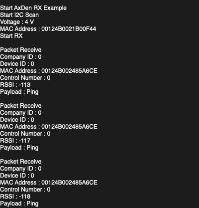</td>
    <td>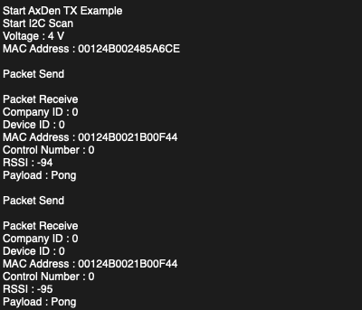</td>
  </tr>
  <tr align="center">
    <td>RF rx example terminal</td>
    <td>RF tx example terminal</td>
  </tr>
</table>
 

### Hardware 설정
어댑터 보드에 CC1312 카드를 장착 후, 아래와 같이 주변 컴포넌트를 조정합니다.

|컴포넌트 명|설정|
|:---:|:---:|
|RX / TX 스위치|우측 슬라이드 조정|
|RTS / CTS 스위치|우측 슬라이드 조정|
|전원 점퍼|3.3V 점퍼 연결|
|전원 스위치|우측 슬라이드 조정 (ON)|

* _수신감도를 높이기 위해서 CC1312 카드에 안테나를 연결합니다._
 

### 펌웨어 설정 및 컴파일
1. 먼저 프로젝트를 clone 후 [CCS studio](https://software-dl.ti.com/ccs/esd/documents/ccs_downloads.html)에서 프로젝트를 import 합니다.

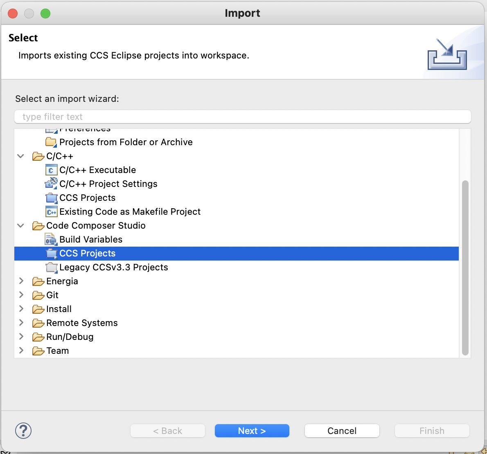

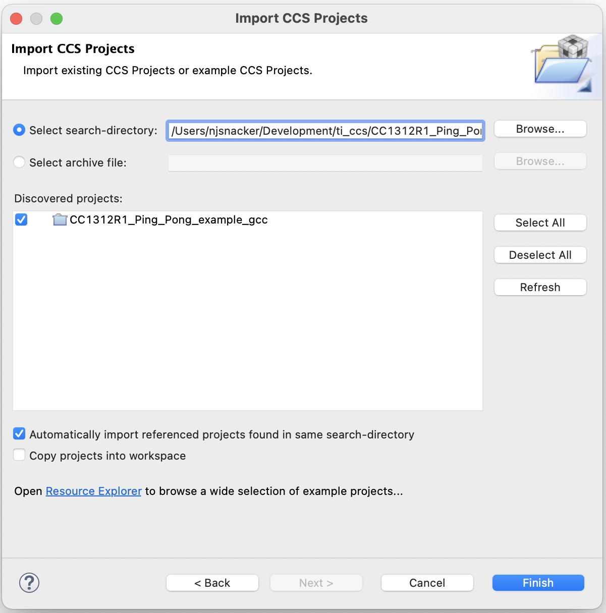

 

2. Dependency 이슈 해결을 위해 프로젝트 속성 창에서 다음 설정을 확인 합니다.

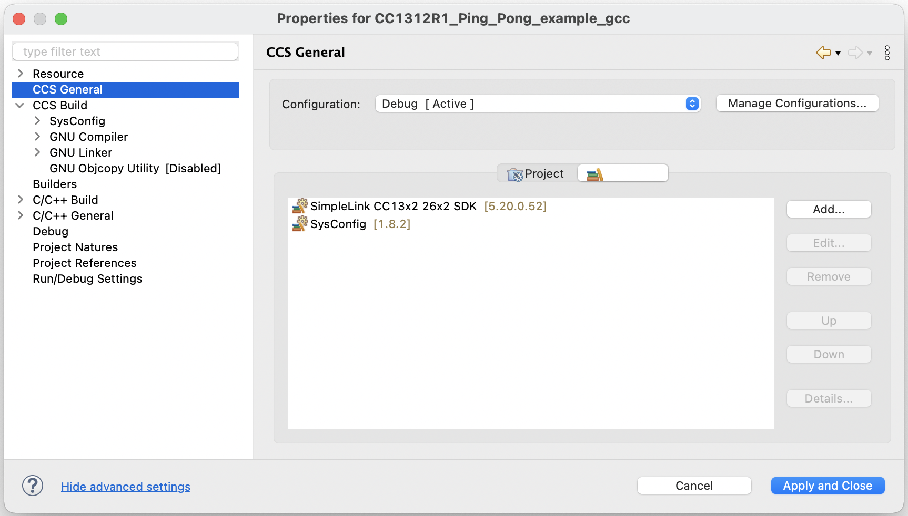

&nbsp;&nbsp;&nbsp;&nbsp;&nbsp;&nbsp;&nbsp;\* CCS General -> Product 에서
&nbsp;&nbsp;&nbsp;&nbsp;&nbsp;&nbsp;&nbsp;`SimpleLink CC13x2 26x2 SDK` 및 `SysConfig` 설정 확인 

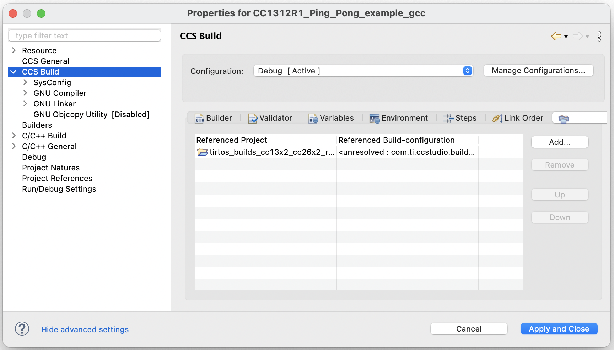

&nbsp;&nbsp;&nbsp;&nbsp;&nbsp;&nbsp;&nbsp;\* CCS Build -> Dependencie 에서
&nbsp;&nbsp;&nbsp;&nbsp;&nbsp;&nbsp;&nbsp;`tirtos_builds_cc13x2_cc26x2_release_gcc` 설정 확인 

3. Protocol.h 파일 8~9 라인의 `#define EXAMPLE_TX` 및 `#define EXAMPLE_RX` 를 수정하여
   각 디바이스에 맞게 tx / rx 펌웨어를 빌드 합니다.

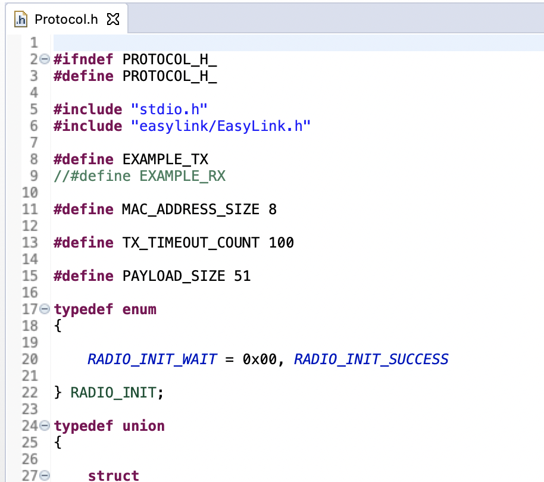

 

### 펌웨어 플래싱
빌드된 펌웨어를 플래싱 하기 위해서는 [Segger J-link](https://www.segger.com/products/debug-probes/j-link/) 혹은 [Ti XDS110 디버그 프로브](https://software-dl.ti.com/ccs/esd/documents/xdsdebugprobes/emu_xds110.html) 가 필요 합니다.
<table>
  <tr align="center">
    <td>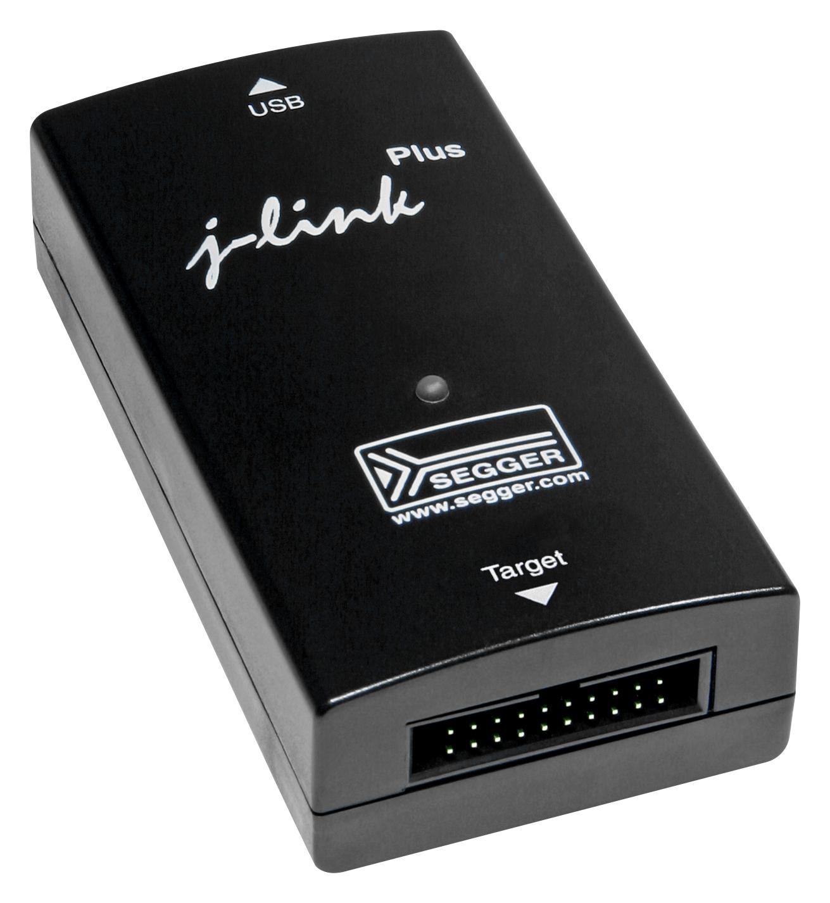</td>
    <td>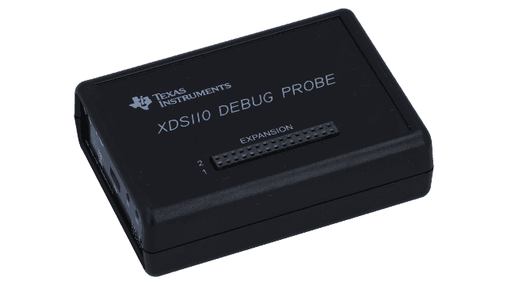</td>
  </tr>
  <tr align="center">
    <td>Segger J-link</td>
    <td>Ti XDS 110</td>
  </tr>
</table>

보유한 디버그 프로브에 따라 프로젝트 폴더의 `targetConfigs -> CC1312R1F3.ccxml` 파일에서
`Connection` 방법을 선택합니다.

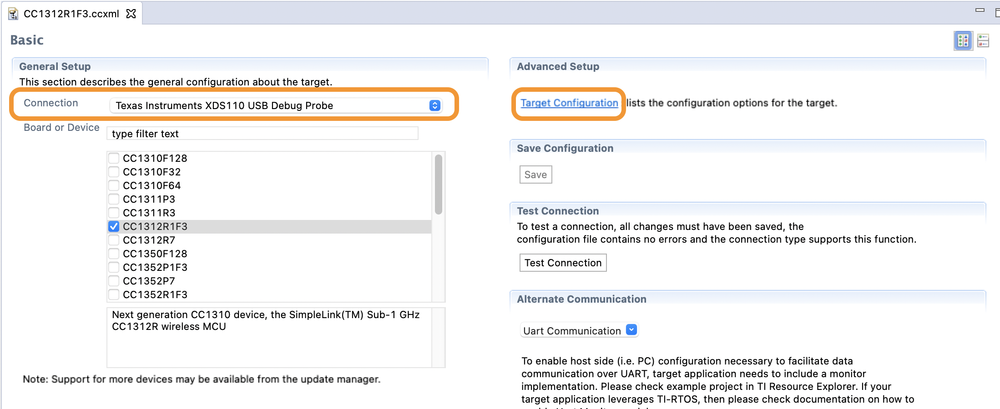

이후 사진의 `TargetConfiguration` 을 클릭하여 Debug interface 가
`cJTAG(1149.7) 2-pin advanced modes` 로 설정되어있는지 확인합니다.

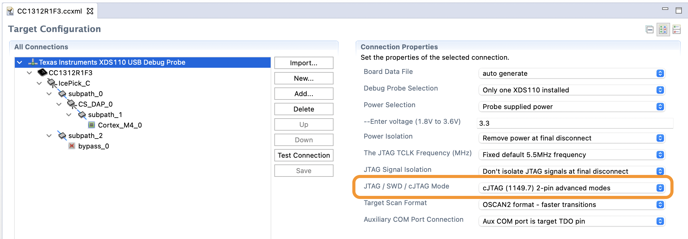

 

모든 설정이 완료되었으면 보드와 IDC 케이블 (1.27mm 10pin 2x5) 을 아래 사진과 같이 연결후
CCS STUDIO 의 debug 아이콘을 눌러 펌웨어를 플래싱 합니다.

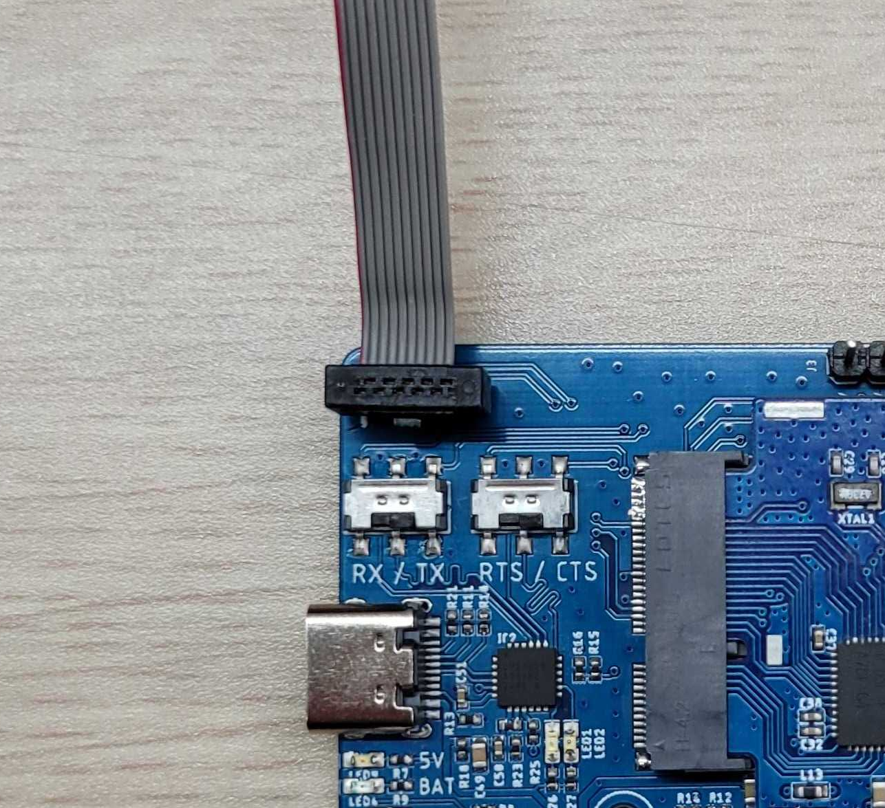

 

### Hardware 핀맵

버튼 핀맵
|Button1|Button2|Button3|Button4|
|:---:|:---:|:---:|:---:|
|N.C.|DIO7|DIO6|N.C.|

LED 핀맵
|LED1|LED2|LED3|LED4|
|:---:|:---:|:---:|:---:|
|N.C.|DIO20|DIO19|DIO18|

GPIO 핀맵
|SCL|SDA|GPIO1|GPIO2|ADC|
|:---:|:---:|:---:|:---:|:---:|
|DIO3|DIO4|DIO8|DIO5|DIO25|

 

References
---------------
* Ti CC1312 Product page [link](https://www.ti.com/product/CC1312R)
* Ti CC1312 Datasheet [link](https://www.ti.com/lit/gpn/cc1312r)
* Ti SimpleLink Academy - Proprietary RF [link](https://dev.ti.com/tirex/explore/node?node=AI5q3CPuoG4eTJh.mjSNgw__pTTHBmu__LATEST)
* Segger J-link product Wiki [link](https://wiki.segger.com/Debug_Probes_-_J-Link_%26_J-Trace)
* Ti XDS110 debug probe manual [link](https://www.ti.com/lit/ug/koku001/koku001.pdf?ts=1644134430052&ref_url=https%253A%252F%252Fwww.ti.com%252Fsitesearch%252Fdocs%252Funiversalsearch.tsp%253FlangPref%253Den-US%2526searchTerm%253Dxds110%2526nr%253D6770)
